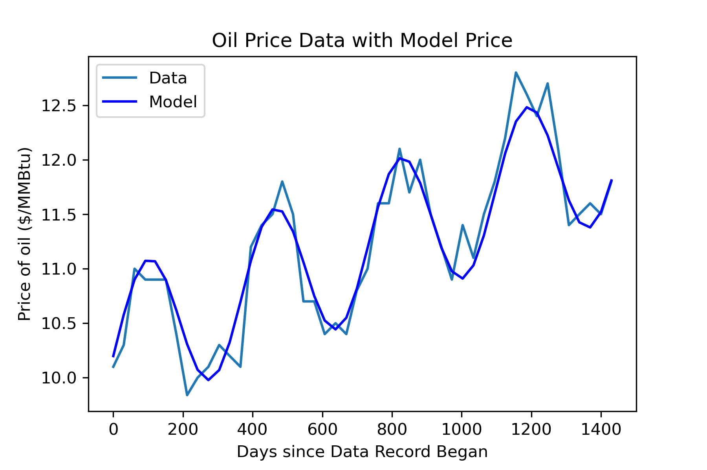

# Gas-Trading-Contract-Value-Forecasting
Analyzes gas price variations (2020–2024) to forecast prices, model storage and trading costs, and estimate contract profit based on injection dates and volumes.
## Features

-	The model combines annual gas price fluctuations (fitted with SciPy’s curve_fit) and long-term average price growth (captured with scikit-learn’s LinearRegression) to generate a more accurate price forecast.

-	Transforms calendar dates into a numeric index of the number of days passed since beginning of the data set,  so they can be used as inputs for the price forecast model.

-	Visualizes gas price data set and its fitted model together in a plot.

-	Takes input information of dates of injection, cost per MMBtu to inject, date of withdrawal, amount of gas bought and cost to store gas, all of which inform the model.

## Skills

-	Linear regression model fitting
-	Sinusoidal curve model fitting 
-	Handling date formatting as inputs in numerical code
-	Extrapolating models 
-	Processing large data sets and many variables

## Images

  

## License

This project is shared under the [MIT License](./LICENSE).  
Please do not reuse this work for academic credit without permission.

## Author

Sarah Nicole Straw
BSc Physics, University of Bristol
GitHub: Sarah-Straw

